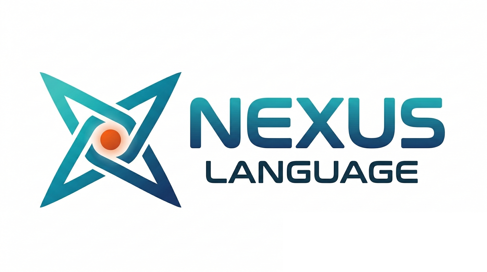

# Nexus

<center>
  
</center>


Nexus is a programming language designed around one observation: **LLMs are strong at literal program constructs but weak at contextual ones.**

Implicit control flow, hidden state, and ambient authority are where LLMs (and humans reviewing LLM-generated code) fail. Nexus eliminates these by making every resource, every side effect, and every capability requirement syntactically visible at the point of use.

## Design Thesis

Traditional languages rely heavily on *contextual* mechanisms -- garbage collection, implicit conversions, ambient I/O, exception propagation through unmarked call stacks. These are precisely the patterns where LLM-generated code becomes unreliable and human review becomes difficult.

Nexus inverts this:

| Contextual (eliminated) | Literal (introduced) |
|---|---|
| Implicit resource cleanup (GC) | `%` linear types -- consumed exactly once |
| Hidden aliasing | `&` borrow -- explicit read-only view |
| Ambient I/O | `require { Net }` -- declared capability |
| Implicit control transfer (continuations) | `try/catch` -- traditional unwind semantics |
| Positional arguments | `add(a: 1, b: 2)` -- mandatory labels |

Every resource state, every side effect, every environmental dependency is visible in the source text. Nothing is implied by context.

## Why Coeffects, Not Effects

Most effect system research focuses on *algebraic effects* -- functions perform effects, and handlers intercept them using delimited continuations. This gives handlers the power to resume, restart, or abort the effectful computation.

Nexus deliberately rejects this model. Continuations are the quintessential *contextual* construct: the control flow depends on what handler happens to be installed at runtime, and the handler's behavior (resume or not) is invisible at the call site.

Instead, Nexus uses **coeffects** -- the `require { ... }` clause declares what capabilities a function *needs from its environment*, not what it *does to* the environment:

```nexus
port Logger do
  fn info(msg: string) -> unit
end

let greet = fn (name: string) -> unit require { Logger, Console } do
  Logger.info(msg: "Greeting " ++ name)
  Console.println(val: "Hello, " ++ name ++ "!")
  return ()
end
```

`Logger.info(...)` is a **direct call** to a statically resolved handler method -- not an effect operation that suspends into a continuation. The handler is a plain value implementing an interface:

```nexus
let console_logger = handler Logger require { Console } do
  fn info(msg: string) -> unit do
    Console.println(val: "[INFO] " ++ msg)
    return ()
  end
end
```

`inject` supplies handler values to a scope, discharging the corresponding `require`:

```nexus
let main = fn () -> unit require { PermConsole } do
  inject stdio.system_handler do
    inject console_logger do
      greet(name: "Nexus User")
    end
  end
  return ()
end
```

This is dependency injection, not algebraic effect handling. No continuations, no implicit control transfer, no hidden resume points. The only builtin effect is `Exn` (exceptions), handled via traditional `try/catch` with unwind semantics.

## Linear Types and Borrowing

Resources that must be properly released -- file handles, server sockets, database connections -- are tracked as **linear types** (`%`). The compiler enforces exactly-once consumption:

```nexus
let %h = Fs.open_read(path: path)
let %r = Fs.read(handle: %h)      -- %h consumed here
match %r do
  case { content: c, handle: %h2 } ->  -- %h2 extracted
    Fs.close(handle: %h2)      -- %h2 consumed
end
```

When you need to read without consuming, **borrow** with `&`:

```nexus
let server = Net.listen(addr: addr)
let req = Net.accept(server: &server)  -- borrow: server not consumed
let method = request_method(req: &req)   -- borrow: req not consumed
Net.respond(req: req, ...)         -- req consumed
Net.stop(server: server)         -- server consumed
```

No garbage collector. No implicit drop. The resource lifecycle is visible in the syntax.

## Capability-Based Security

Runtime permissions map directly to WASI capabilities:

```nexus
let main = fn () -> unit require { PermNet, PermConsole } do
  inject net_mod.system_handler, stdio.system_handler do
    try
      let body = Net.get(url: "https://example.com")
      Console.println(val: body)
    catch e ->
      Console.println(val: "Request failed")
    end
  end
  return ()
end
```

The `require { PermNet, PermConsole }` clause is checked at compile time and enforced at the WASI runtime level. A function cannot perform network I/O unless it declares `PermNet` and a handler is injected.

## Usage

```bash
nexus               # REPL
nexus run example.nx        # interpret
nexus build example.nx      # compile to main.wasm
nexus build example.nx -o out.wasm
nexus check example.nx      # typecheck only
nexus check --format json example.nx  # structured diagnostics (LLM-friendly)
nexus lsp            # start Language Server (stdio)
```

```bash
wasmtime run -Scli main.wasm
wasmtime run -Scli -Shttp -Sinherit-network -Sallow-ip-name-lookup -Stcp main.wasm
```

## Example

```nexus
import { Console }, * as stdio from stdlib/stdio.nx
import { from_i64 } from stdlib/string_ops.nx

let fib = fn (n: i64) -> i64 do
  if n <= 1 then return n end
  return fib(n: n - 1) + fib(n: n - 2)
end

let main = fn () -> unit require { PermConsole } do
  inject stdio.system_handler do
    let v = fib(n: 30)
    Console.println(val: "fib(30) = " ++ from_i64(val: v))
  end
  return ()
end
```

## AI Coding Agent Support

Nexus ships a [Claude Code skill](https://docs.anthropic.com/en/docs/claude-code/skills) that teaches coding agents the language syntax, type system, effect system, and standard library.

```bash
npx skills add Nymphium/Nexus --skill nexus-lang
```

Once installed, Claude Code automatically activates the skill when writing or reviewing `.nx` files.

## Documentation

| Document | Description |
|---|---|
| [Design](docs/design.md) | Design thesis: literal vs contextual |
| [Syntax](docs/spec/syntax.md) | Grammar and EBNF |
| [Types](docs/spec/types.md) | Type system, linear types, borrowing |
| [Effects](docs/spec/effects.md) | Coeffect system, ports, handlers |
| [Semantics](docs/spec/semantics.md) | Evaluation model, entrypoint |
| [CLI](docs/env/cli.md) | Command-line interface |
| [WASM](docs/env/wasm.md) | WASM compilation and WASI capabilities |
| [FFI](docs/env/ffi.md) | Wasm interop |
| [Stdlib](docs/env/stdlib.md) | Standard library |
| [Tools](docs/env/tools.md) | LSP server, CLI diagnostics, AI coding agent skill |

## License

[MIT](LICENSE)
